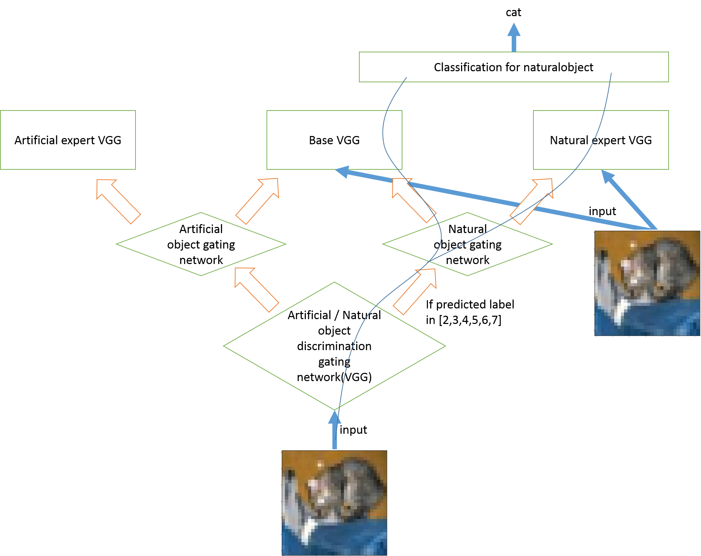
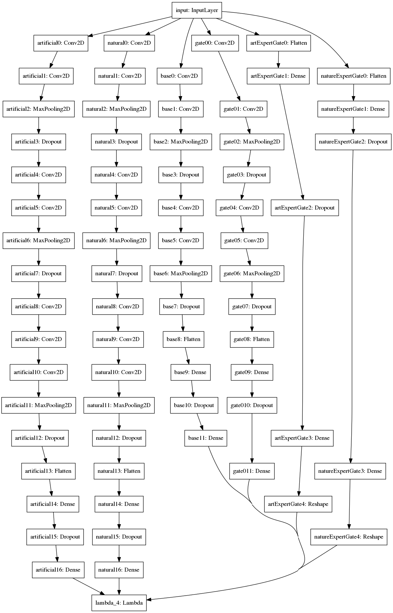

# Mixture of Experts on Convolutional Neural Network
Mixture of experts is a ensemble model of neural networks which consists of expert neural networks and gating networks. The expert model is a series of neural network that is specialized in a certain inference, such as classifying within artificial objects or within natural objects. The gating network is a discriminator network that decides which expert, or expers, to use for a certain input data, with importance of each expert.
 
The mixture of experts can take one gating network, if only deciding an importance of experts, or multiple gating networks, to probabilistically split decision phases to hierarchical order, just like decision tree diagram.
  
The expert models are pretrained to do only feed-forward inference in the mixture of experts model.
 
Training phase of the mixture of experts is to train the gating networks to improve decision making of which experts to use with weighted degree of importance of each experts.
  
This notebook shows a way to use mixture of experts model with deep learning. The objective is to classify images, using Cifar10 and convolution neural netwok. The mixture of experts model takes hierarchical multiple gating networks, to first decide if the input image is artificial object or natural object. Then the next gating network decides importance of each expert models. 
  
There are three expert models:  
basic VGG, which is trained to classify all 10 classes  
artificial expert VGG, which is trained only to classify artificial objects, that have a label in 0, 1, 8 and 9  
natural expert VGG, which is trained only to classify natural objects, that have a label in 2, 3, 4, 5, 6 and 7  
 
 
 
## The overview of the mixture of experts model

 

The first gating network, that decides which way to take, artificial or natural, is a pretrained VGG neural network, to classify the input data.
  
The second gating network layer, consists of two gating networks, decides the importance of each experts.  
The artificial gating network flows classification job to artificial expert VGG and base VGG, only activated when the first gating network decided the input data is an artificial object. 
 
The natural gating network flows classification job to natural expert VGG and base VGG, only the first gating netword decided as a natural object.
  
The classification output is a sum of softmax of expert VGG and base VGG, with importance from previous gating network multiplied.
  
For instance, if the input image is a cat, then the first gating network identifies it is a natural object, routing to the natural gating network in the second layer gating. The natural gating network predicts importance of expert networks, base VGG and natural expert VGG, in softmax probability. The expert networks infers the image class in softmax, and each of them is multiplied by the importance to finally output the inference.
 
The routing of the gatings are as follows:
 

 
The notebook uses Keras with Tensorflow backend to implement the mixture of network model for classifying Cifar10.
 
The Cifar10 consists of 10 classes of images, with label of each class representing the following.
  
0 airplane  
1 automobile  
2 bird  
3 cat  
4 deer  
5 dog  
6 frog  
7 horse  
8 ship  
9 truck  

## The mixture of experts neural network

